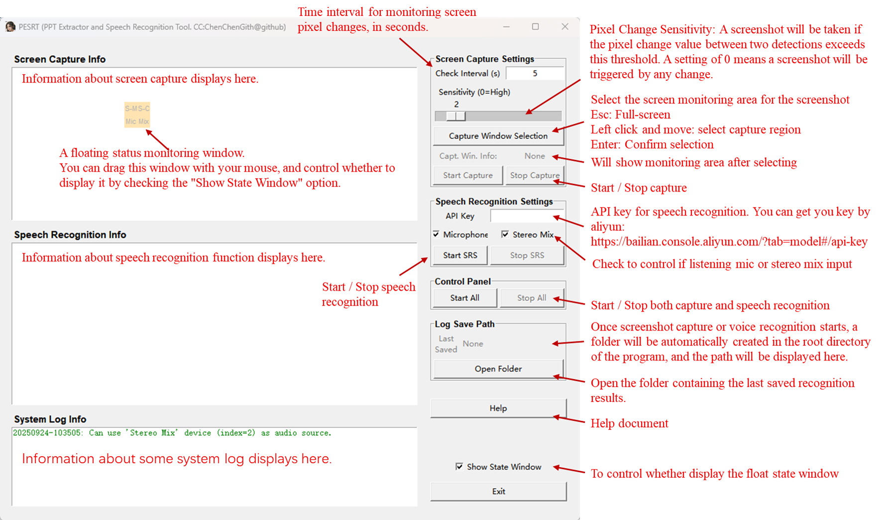

This is a python tool for capturing images automatically by periodic check whether the pixels in the designate have been changed.
20250924 News! Now this tool can perform speech recognition using Alibaba Cloud's real-time speech recognition model.

The exe program can be found in the releas page: [Releases · ChenChenGith/Video_PPT_capture](https://github.com/ChenChenGith/Video_PPT_capture/releases)

Requirment:

- Python>=3.8
- pillow>=10.4.0
- screeninfo>=0.8.1
- dashscope>=1.24.5
- pyaudio>=0.2.14

# Usage:



## The float window for function state

The first line displays the status of the screenshot capture function:

- The left indicator S-M turns red to show it is currently monitoring the selected area.
- The right indicator S-C turns red if a screenshot has been taken.

The second line displays the status of the speech recognition function:

- The left indicator Mic turns red to show it is currently listening to microphone input.
- The right indicator Mix turns red if it is currently monitoring stereo mix audio; if the Mix indicator is gray, stereo mix is unavailable.

## LLM service for voice recognition

**You need to enable stereo mix on your computer to capture system audio output! Here's how:**

**Settings - System - Sound - All sound devices - Enable Stereo Mix**

This feature uses the real-time speech recognition model provided by Alibaba Cloud: paraformer-realtime-v2, so an API key is required for connection.

Model page: https://bailian.console.aliyun.com/?tab=model#/model-market/detail/paraformer-realtime-v2

API Key application page: https://bailian.console.aliyun.com/?tab=model#/api-key

New users are entitled to a free trial of 10 hours. If you choose the paid version, the price is only 0.86 RMB per hour (0.12 USD)!

Once an API key has been entered, it will be automatically saved in a text file in the root directory of the program and will be automatically loaded when the program is opened again.

## Important

The computer will not enter sleep mode or turn off the screen during screen and audio monitoring.


## 功能状态的浮动窗口
第一行显示截图功能的状态：
- 左侧指示灯 S-M 变红，表示当前正在监控选定区域。
- 右侧指示灯 S-C 变红，表示已进行过截图操作。

第二行显示语音识别功能的状态：
- 左侧指示灯 Mic 变红，表示当前正在监听麦克风输入。
- 右侧指示灯 Mix 变红，表示当前正在监控立体声混音音频；若 Mix 指示灯为灰色，则表示立体声混音不可用。

## 语音识别的LLM服务

**需要启动电脑的立体声混音，才能够捕捉系统输出！具体方法：设置-系统-声音-所有声音设备-打开立体声混音**

本功能使用阿里云提供的实时语音识别模型：paraformer-realtime-v2，因此连接时需要API密钥。

模型页面：https://bailian.console.aliyun.com/?tab=model#/model-market/detail/paraformer-realtime-v2

申请API密钥页面：https://bailian.console.aliyun.com/?tab=model#/api-key

新用户享有10小时的免费试用。若选择付费版本，价格仅为每小时0.86人民币（0.12美元）！

一旦输入了API密钥，它将自动保存在程序根目录下的一个文本文件中，并在下次打开程序时自动加载。

## 重要

在进行屏幕和语音监测期间，电脑将不会进入睡眠和关闭屏幕。

# Update

## 20250924

The voice recognition feature has been added.

Optimizations have been made to the interface and storage paths.

## 20250122

Support multi-screen with any layout.

Remove Numpy to reduce the exe size (from 35M to 12M, have not release).

Modify the initial location of the float window, to let user note it.

Add a checkbox to allow user to chose whether display float window.

Add a button for opening the image save path.

# TODO:

- [X] Test on multiple displays
- [X] Allow users to config whether display float window

# Compile:

The exe program is compiled by ``pyinstaller``. To reduce the exe size, it is better to create a new environment and install necessary package.

Then use the following command to generate exe program:

```
pyinstaller -Fw -i asset/ycy.ico --add-data "asset;asset" screen_capture.py
```
