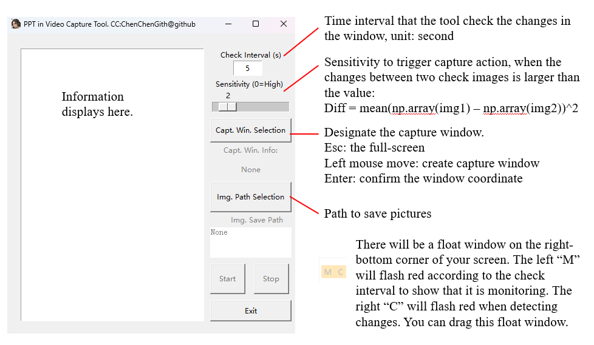

This is a python tool for capturing images automatically by periodic check whether the pixels in the designate have been changed.

The exe program can be found in the releas page: [Release Video_PPT_Capture_v0.1.0 · ChenChenGith/Video_PPT_capture](https://github.com/ChenChenGith/Video_PPT_capture/releases/tag/VPC)

# Usage:

# Update

## 20250120

Support multi-screen with any layout.

Remove Numpy to reduce the exe size (from 35M to 12M, have not release).

Modify the initial location of the float window, to let user note it.

Add a checkbox to allow user to chose whether display float window.

# TODO:

- [X] Test on multiple displays
- [X] Allow users to config whether display float window
- [ ] Allow users to config using json file
